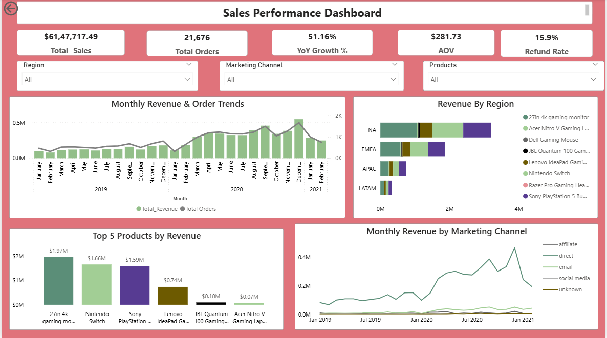
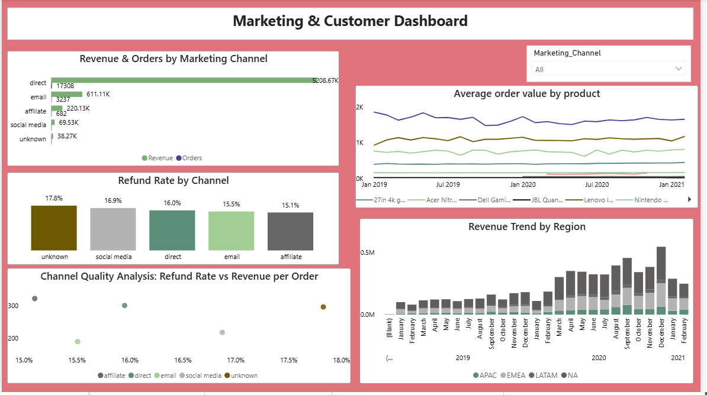
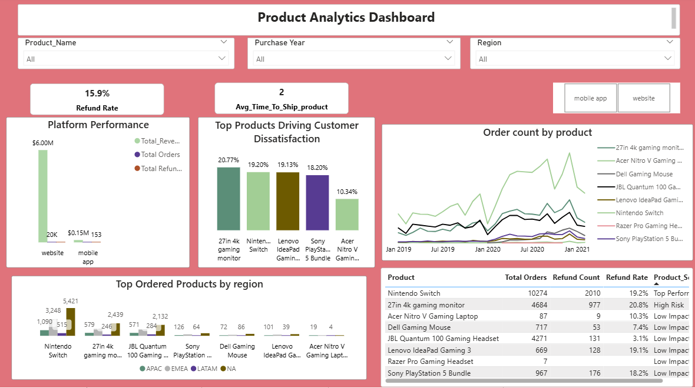

# 🎮 GameZone: End-to-End E-commerce Analytics & Growth Strategy  

## 📌 Summary  

This project analyzes GameZone’s e-commerce data (2019–2022) to support business decision-making across product, marketing, and finance teams. The objective is to evaluate revenue performance by identifying key trends, patterns, and drivers across products, time, regions, and marketing channels. A structured approach is used to translate raw data into actionable insights, enabling stakeholders to optimize growth strategy, improve marketing effectiveness, and make data-driven product decisions.

---

## 🗂️ Data Summary  

The analysis is based on two primary datasets:

### 1. Orders Table (Cleaned)  

The original orders dataset was cleaned and transformed into a structured format. Key preprocessing steps included timestamp standardization, feature extraction, and categorical cleaning.

**Final Columns:**  
- USER_ID, ORDER_ID  
- PURCHASE_TS, PURCHASE_TS_CLEANED  
- PURCHASE_YEAR, PURCHASE_MONTH  
- TIME_TO_SHIP, SHIP_TS, REFUND_TS  
- PRODUCT_NAME, PRODUCT_NAME_CLEANED, PRODUCT_ID  
- USD_PRICE  
- PURCHASE_PLATFORM  
- MARKETING_CHANNEL, MARKETING_CHANNEL_CLEANED  
- ACCOUNT_CREATION_METHOD, ACCOUNT_CREATION_METHOD_CLEANED  
- COUNTRY_CODE, REGION  
- DATA_CHECK  

---

### 2. Region Table  

A lookup table used to map users geographically.

**Columns:**  
- COUNTRY_CODE  
- REGION  

Joined with orders using **COUNTRY_CODE** to enable regional analysis.

---

## ❓ Business Questions  

### Q1. Revenue Trend Analysis  
How did total revenue across all products perform during 2019–2022?

### Q2. Product-Level Deep Dive  
What was happening in the top 3 products that contributed to the sales dip?

---

## 📊 Initial EDA (Exploratory Data Analysis)

- Analyzed monthly revenue trends (2019–2022)  
- Evaluated product-level performance  
- Compared category-level contribution  
- Identified seasonal patterns and spikes  
- Investigated product behavior during peak and dip periods  

---

## 📸 EDA Visuals  
.png)

---

## 🔍 Key Findings  

- Total revenue ≈ **$6.1M**, with monthly sales ranging from **$80K to $500K**  
- Gaming Monitor is the top-performing product (~$2M), while Gaming Headset is the lowest (~$800), indicating potential data gaps  
- Headset category contributes **<2%** of total sales  
- Significant spike observed in **December 2020**, indicating seasonal or promotional impact  
- Sales increased sharply post-2020, suggesting macro-level influence (e.g., COVID)  
- Consistent spike across products in December 2020, likely driven by campaigns  
- Identified data inconsistencies in shipping timestamps requiring further validation  

---

## 📊 Power BI Analysis (Business Questions)

### 💰 Revenue & Finance  
- Revenue trends and seasonality  
- Monthly performance fluctuations  

### 📦 Product Performance  
- Top revenue-contributing products  
- Drivers of sales decline  

### 📢 Marketing & Channels  
- Channel-wise revenue contribution  
- Dependency on direct channel  

### 🌍 Regional Analysis  
- Regional revenue distribution  
- Region-specific trends  

### ⚙️ Operations & Customer Behavior  
- Shipping delays and refunds  
- Customer acquisition patterns  

---

## 📊 Sales Performance Dashboard  

### 🔍 Key Insights  

- Total revenue ~$6.1M with ~21.6K orders  
- ~51% YoY growth with peak in late 2020  
- AOV ~$281 indicating stable spending behavior  
- High refund rate (~15.9%) impacting revenue  
- Seasonal peaks during Nov–Dec  
- NA is the top-performing region  
- Direct channel dominates revenue  

### 💡 Recommendations  

- Reduce refund rate through quality and delivery improvements  
- Leverage seasonal demand with targeted campaigns  
- Diversify marketing channels beyond direct traffic  
- Focus on high-performing products  
- Improve underperforming categories  
- Expand successful strategies across regions  

---

## 📊 Marketing & Customer Analysis  

### 🔍 Key Insights  

- Direct channel dominates revenue and orders  
- Email and affiliate perform moderately  
- Social and unknown channels underperform  
- Refund rates are high across channels (~15–18%)  
- NA leads regional contribution  
- Some channels show high revenue but high refunds  

### 💡 Recommendations  

- Reduce dependency on direct channel  
- Optimize high-refund channels  
- Improve channel ROI  
- Promote high AOV products  
- Improve social media performance  
- Fix channel attribution issues  

---

## 📊 Product Analytics  

### 🔍 Key Insights  

- Website significantly outperforms mobile app  
- High refund rate indicates customer dissatisfaction  
- Top products also show high refund rates  
- Few products dominate order trends  
- Regional demand varies across products  

### 💡 Recommendations  

- Improve product quality and expectations  
- Optimize top-performing products  
- Enhance mobile app experience  
- Implement region-specific strategies  
- Reduce refunds through root cause analysis  
- Balance product portfolio  

---

## 👩‍💻 Author  

**Mahak Bisht**  
📧 mahak.bisht2003@gmail.com  
🔗 [LinkedIn](https://www.linkedin.com/in/mahak-bisht-79241528a)  
💻 [GitHub](https://github.com/mahakb2003)

